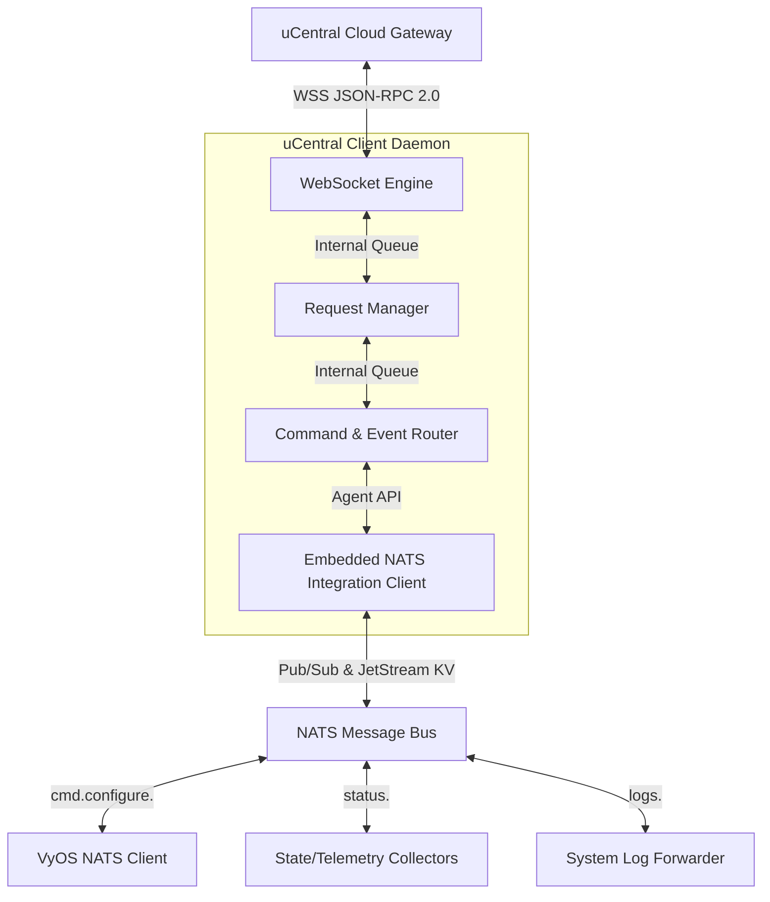
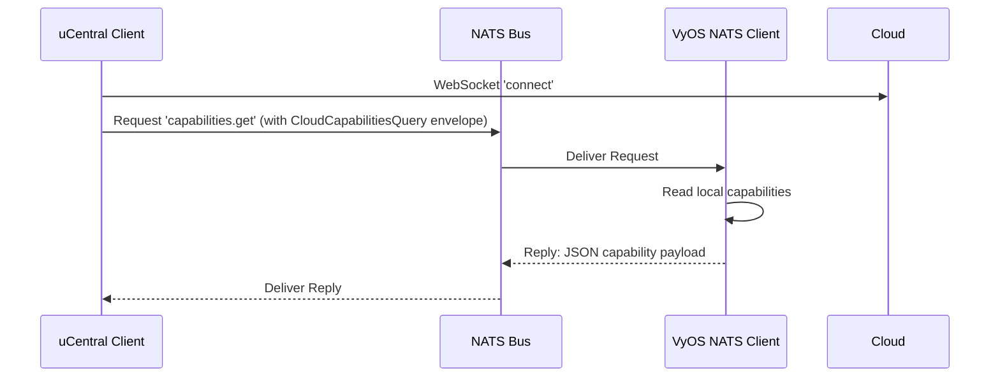
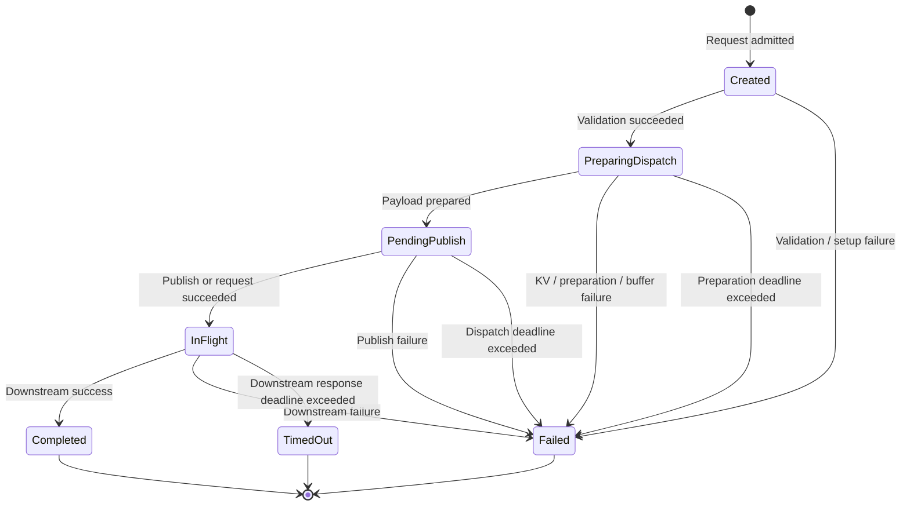
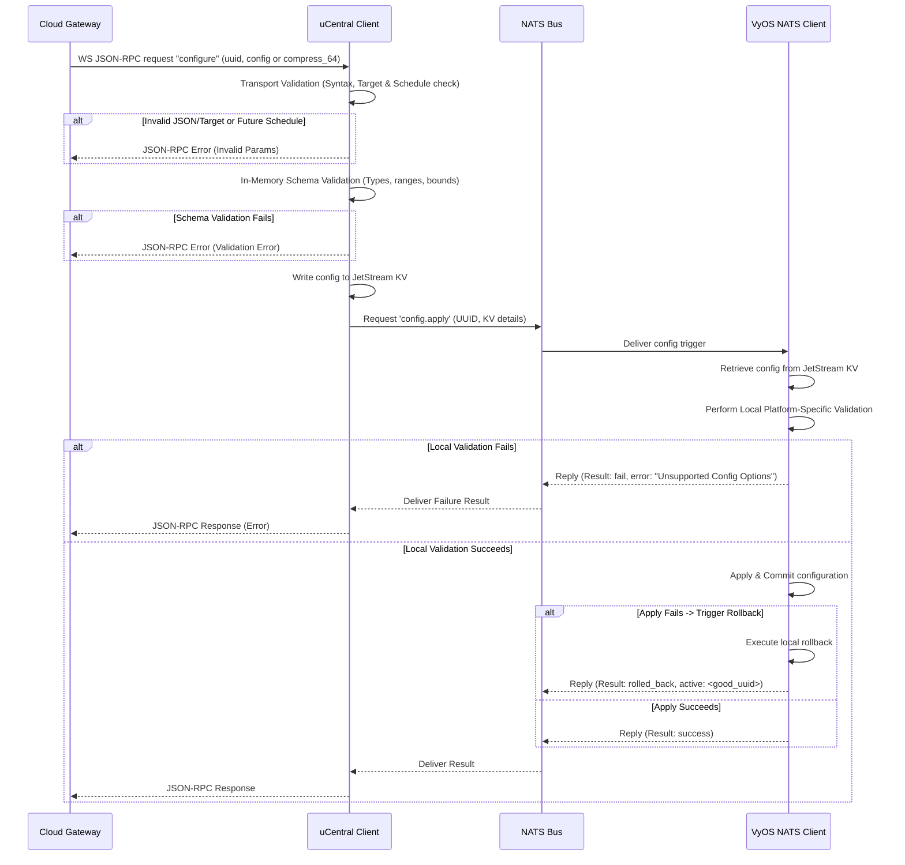
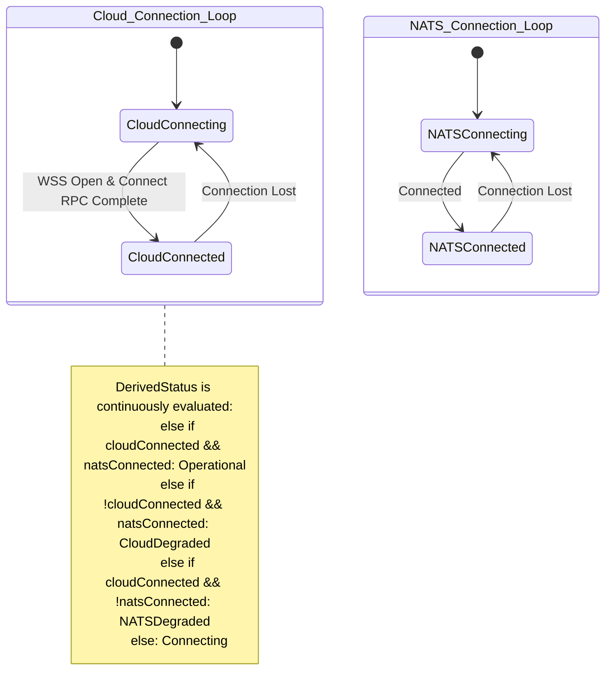

# High-Level Design: uCentral Client with NATS Integration (Language-Agnostic)

This document outlines the High-Level Design (HLD) for the **uCentral Client** (`TIP-olg-ucentral-client`). This client acts as a gateway/bridge between a cloud-based management platform (via the uCentral WebSocket/JSON-RPC protocol) and local device services (such as the VyOS NATS Client) using a local **NATS message bus**.

---

## 1. Architectural Overview

The uCentral client is a daemon that embeds a standard NATS agent library (modeled after the `nats-agent-core` specification). It acts as a **north-south proxy**, bridging the WAN Cloud interface with the LAN NATS bus. 

### Component Architecture



### 1.1 Ownership Boundaries
To avoid ambiguity between the uCentral client and downstream NATS microservices (such as the VyOS NATS Client), responsibilities are strictly divided as follows:

| Responsibility | Owning Component | Description |
| :--- | :--- | :--- |
| **Transport Validation** | uCentral Client | Checks JSON integrity, validates headers, and ensures the target serial matches the client config. |
| **Schema Parameter Validation** | uCentral Client | Validates incoming configuration payload values (parameter types, bounds, ranges, required fields) in-memory before NATS writes, using a compiled-in validator generated from the `olg-ucentral-schema` repository. **Permissive mode** is enforced: known fields are validated strictly, while unknown future fields are passed through to avoid tight coupling. |
| **Platform-Specific Translation** | Downstream Agent (e.g., VyOS Client) | Evaluates whether the valid schema properties are supported by the local system and translates them into system actions. |
| **Configuration Rollback**| Downstream Agent (e.g., VyOS Client) | Manages the configuration transaction; if an applied configuration fails connectivity or validation checks, the downstream agent performs a transaction rollback to the last known good configuration. |

### 1.2 Dedicated Request Manager
To decouple message routing from request lifecycles, the uCentral Client includes a **Request Manager** module responsible for:
*   **Correlation Tracking:** Maps outgoing NATS commands to incoming Cloud JSON-RPC requests using request IDs.
*   **Deduplication & Cache:** Handles duplicate requests and caches responses.
*   **Request Timeouts:** Enforces timeouts using non-blocking timers and triggers failure responses if local components do not respond in time.
*   **Retry Handling:** Automates transaction retries for transient failures. Only idempotent, read-only downstream queries, such as `capabilities.get` and `status.get`, are retryable for transient failures, using a randomized exponential backoff (e.g., base 2s, max 3 attempts). State-changing and security-sensitive actions (`configure`, `reboot`, `factory`, `upgrade`, `certupdate`, `reenroll`, `script`) must fail fast without automatic retries. The `status.get` subject is owned by the downstream device/local agent; the uCentral client publishes requests to it and must not subscribe to or respond on it.
*   **Metrics Collection:** Tracks latencies, throughputs, and success/error rates per command.

---

## 2. NATS & JetStream Interface

The client leverages standard structures, helper APIs, and connection wrappers defined in the NATS agent library.

### 2.1 Common Message Envelopes
To ensure interoperability, the uCentral client standardizes on standard envelopes:

#### Outgoing Configuration Trigger (ConfigureCommand)
```json
{
  "version": "1.0",
  "rpc_id": "8bc92d11-536c-4860-9d8a-6809694b78ba",
  "target": "00:11:22:33:44:55",
  "uuid": "1698765432",
  "kv_bucket": "cfg_desired",
  "kv_key": "desired.00:11:22:33:44:55",
  "timestamp": "2026-07-20T10:00:00Z"
}
```

#### Outgoing Action Envelope (ActionCommand)
```json
{
  "version": "1.0",
  "rpc_id": "c138d6df-85f0-4322-927b-23fcfdf626c0",
  "target": "00:11:22:33:44:55",
  "command_type": "action",
  "action": "reboot",
  "payload": {
    "when": 0
  },
  "timestamp": "2026-06-25T12:01:00Z"
}
```

```json
{
  "version": "1.0",
  "rpc_id": "d249e7e0-96f1-5433-a38c-34fcfdf737d1",
  "target": "00:11:22:33:44:55",
  "command_type": "action",
  "action": "factory",
  "payload": {
    "keep_redirector": 1,
    "when": 0
  },
  "timestamp": "2026-06-25T12:02:00Z"
}
```

#### Inbound Result Envelope (ResultEnvelope)
*Note:* The `uuid` field refers specifically to the Configuration UUID. It is populated only for `configure` commands and is omitted (empty) for transient action commands (such as `reboot` or `trace`).
```json
{
  "version": "1.0",
  "rpc_id": "8bc92d11-536c-4860-9d8a-6809694b78ba",
  "target": "00:11:22:33:44:55",
  "command_type": "configure",
  "uuid": 1687588800,
  "result": "success",
  "message": "Configuration applied and saved successfully.",
  "timestamp": "2026-06-25T12:00:15Z"
}
```

### 2.2 Correlation ID Propagation
The `rpc_id` field in all envelopes acts as the central correlation ID for NATS transactions.
1.  When a Cloud JSON-RPC request is received, the Request Manager constructs a unique `rpc_id` for NATS. For ordinary requests with an ID, it is deterministically generated by combining the WebSocket Session ID and the Cloud's raw JSON-RPC `id` (e.g., `session-123:42`). For read-only notifications without an ID, it constructs a unique ID (e.g., `session-123:notification:<generated-uuid>`). This automatically solves collisions without an in-memory UUID map.
2.  The Request Manager populates the `rpc_id` field of the NATS payload with this deterministic Canonical Cloud ID.
3.  The downstream agent processes the command and returns a `ResultEnvelope` maintaining the exact same `rpc_id`.
4.  The Request Manager uses this correlation ID to look up the original transaction, recovers the Cloud `id`, and returns the response to the correct WebSocket client.

### 2.3 Flat Subject Schema

To guarantee flawless integration with the existing VyOS NATS client, all NATS subjects use a flat `agentcore` architecture without nested namespaces:

*   **Configure Trigger:** `cmd.configure.<target>` (Pub-Sub / Asynchronous Command Delivery)
*   **Action Command:** `cmd.action.<target>.<command>` (Pub-Sub / Asynchronous Command Delivery)
*   **State Publish:** `status.<target>` (Pub-Sub)
*   **Telemetry Publish:** `telemetry.<target>` (Pub-Sub)
*   **Log Publish:** `logs.<target>` (Pub-Sub)
*   **Health Publish:** `health.<target>` (Pub-Sub)
*   **Command Result:** `result.<target>` (Pub-Sub)
*   **Capability Discovery:** `capabilities.get.<target>` (Request-Reply)
*   **Device Status Query:** `status.get.<target>` (Request-Reply)

The `status.get` subject is owned by the downstream device/local agent. The uCentral client publishes request-reply queries to this subject for current device/platform status and upgrade recovery. The uCentral client must not subscribe to or respond on this subject.

*Security Boundary:* Read-only metadata calls (such as capability and status retrieval) are mapped to their own explicit subject namespaces, keeping them separate from destructive/operational `action.*` subjects. The daemon acts as a 1-to-N gateway routing these actions securely to the appropriate downstream agent.

### 2.4 Capability Discovery & Caching Flow
At startup, the client retrieves downstream device capabilities using the dedicated NATS query subject:



*   **Caching Strategy:** The capability cache is populated once after the first usable NATS connection and downstream capability responder availability. If initial retrieval fails, the client retries with bounded exponential backoff until the initial cache is populated. After successful initialization, capabilities are not automatically re-fetched on subsequent NATS reconnect events to avoid traffic congestion.
*   **Refresh Events:** The cache is refreshed only:
    1. Upon detecting a firmware version change.
    2. Upon receipt of a specific system reboot log indicating an upgrade.
    3. If an explicit capability refresh event is received over a local Unix domain socket (restricted to root access).

### 2.5 JetStream Consistency Model
*   **Desired Configuration:** Leverages JetStream Key-Value (KV) store using `cfg_desired` bucket and key `desired.<serial>`. The client writes the desired state to KV, then publishes a lightweight trigger to the `config.apply` subject.
*   **UUID Match Contract:** The NATS configure trigger must carry the `uuid`, `kv_bucket`, and `kv_key` to allow the downstream agent to fetch the configuration.
    *   The downstream agent retrieves the configuration using `kv_key` and compares the configuration UUID with its last successfully applied UUID.
    *   If the received UUID is strictly greater than the last applied UUID, it is applied.
    *   If the received UUID is less than or equal to the last applied UUID, the agent **aborts the stale trigger**. This prevents applying configs whose trigger publishes failed mid-sequence.
*   **Failure Handling:**
    *   *KV write succeeds but publish fails:* The client returns an error to the cloud. The updated configuration exists in KV but remains unapplied. The cloud control plane is responsible for recovering from this failure state.
    *   *Publish succeeds but downstream agent cannot read KV:* The agent returns a NATS error payload. The Request Manager maps this to a configuration error response back to the cloud.

---

## 3. Workflows & Lifecycle Management

### 3.1 Request Manager Transaction State Machine
Every incoming Cloud command is modeled as an asynchronous transaction tracked by a state machine inside the Request Manager:



*   **Created:** Transaction metadata is initialized in memory. The downstream response timeout is not started yet.
*   **PreparingDispatch:** The transaction is actively performing local setup work (e.g., writing to JetStream KV for `configure`, or building the `ActionCommand` envelope).
*   **PendingPublish:** The payload is fully assembled and is either waiting in the dispatch buffer or in the process of being sent over the wire.
*   **InFlight:** The message is published to NATS. The downstream response timeout starts when the transaction enters this state. The Request Manager listens for the matching `rpc_id` reply.
*   **Completed / Failed / TimedOut:** Terminal states. Once reached, the client replies to all registered cloud streams, updates metrics, caches the result, and cleans up transaction memory.

### 3.2 Concurrency & Serialization Rules
To protect device integrity, the client divides requests into two execution classes:

1.  **State-Changing Commands (Serialized):** Commands that modify device state or execute sensitive operations (`configure`, `reboot`, `factory`, `upgrade`, `certupdate`, `reenroll`, `script`, `leds`) are **serialized** (one at a time per device).
    *   *Rule:* The Request Manager must atomically reserve the state lock during transaction creation. If a serialized transaction is currently `Created`, `PreparingDispatch`, `PendingPublish`, or `InFlight`, any new serialized request (with a different Cloud `id`) is immediately rejected with a `busy` status (Error Code -32603 / Result: `busy`).
    *   *Benefit:* Eliminates the overhead of complex command queue backlogs, ensures strict sequential application of system changes, and guarantees state mutation exclusivity.
2.  **Read-Only Commands (Parallel):** Metadata, query operations, and diagnostics (`capabilities.get`, `status.get`, `ping`, `trace`, `telemetry`, `remote_access`) are processed in parallel.
    *   *Rule:* Query operations do not acquire the device state lock and are published to NATS immediately, even if a configuration transaction is in progress.
    *   *Ownership:* `status.get` is a downstream device/local-agent query. The uCentral client sends the request and waits for the downstream response; it does not serve responses on this subject.

### 3.3 Duplicate & Overlapping Requests
*   **Overlapping Duplicate Requests:** If the Cloud retries a command sending the exact same Cloud `id` while a transaction is already active (`Created`, `PreparingDispatch`, `PendingPublish`, or `InFlight`), the client rejects the new request immediately with a JSON-RPC busy/internal error (`-32603`). This avoids complex fan-out/listener attachment logic and ensures predictable client behavior.
*   **Duplicate Completed Requests:** If the request matches a cached Cloud `id` that has already completed *within the same Cloud session*, the Request Manager **replays the cached response** directly to the cloud. Cross-session replay by ID is prohibited.
*   **Cache TTL by Operation Type (Environment Configurable):**
    *   `configure`, `leds`: **5 minutes**
    *   `reboot`, `remote_access`: **10 minutes**
    *   `factory`, `certupdate`, `reenroll`, `script`: **30 minutes**
    *   `upgrade` (Firmware): **60 minutes from completion**. Firmware upgrades are processed as **asynchronous actions**—the client returns an immediate "started" status and forwards progress updates to the cloud.
    *   `ping`, `trace`, `telemetry`, `capabilities.get`, `status.get`: **2 minutes** (Diagnostics default)

### 3.4 Behavior Across Reconnects
*   **Cloud Disconnections:** If the WAN connection to the Cloud drops while a transaction is `InFlight`, the client **continues running the operation downstream**. It does not abort the configuration or reboot.
*   **Result Recovery:** If NATS replies while the Cloud is disconnected, the client stores the result in its transaction cache. Once the Cloud reconnects, old-session cached responses are *not* replayed merely by reusing the same JSON-RPC ID. The Cloud must use an explicit status query or `operation_id` mechanism to recover the final outcome, or initiate a new transaction.

### 3.5 Asynchronous Upgrades (Firmware)
Firmware upgrades take minutes to complete and cannot block the Request Manager or hold the WebSocket connection open. The architecture defines the following cross-component contracts for upgrades:

1.  **Operation ID:** A persistent `operation_id` must be generated to identify the long-running upgrade process independently of the original JSON-RPC `id` and the NATS `rpc_id`.
2.  **Initial Response:** The client receives the `upgrade` command, validates it, and immediately returns a JSON-RPC "started" response (closing the JSON-RPC exchange) to the Cloud.
3.  **Background Tracking & Authoritative Status:** The upgrade continues executing asynchronously. The downstream agent must expose structured, authoritative upgrade status. The uCentral client must use this structured status to determine completion; **system logs must not be used as a completion signal**.
4.  **State Lock Lifetime:** The state-changing lock (`activeStateTx`) remains held until a defined terminal upgrade state (e.g., success, failure) is received from the downstream agent.
5.  **Reconnection Resilience:** Upon WebSocket reconnection, the daemon resumes reporting the current upgrade state to the Cloud using the persistent `operation_id`.
6.  **Crash Recovery (Startup Query):** To prevent losing the in-memory state lock if the daemon process crashes, the daemon must explicitly load the active operation from the `OperationStore` on boot to recover the Cloud JSON-RPC `id` and **immediately restore the `activeStateTx` lock**. It must then query the downstream agent via `status.get.<target>` generating a **fresh internal `rpc_id`**, correlate the generic response using the locally persisted `operation_id` (as the NATS agent does not track Cloud identities), and release the lock if a terminal state is observed. The uCentral client is only the requester for this subject; it must not subscribe to or respond on `status.get`.
7.  **Duplicate Rejection:** Any state-changing commands received while the background upgrade is active are rejected immediately as busy.

### 3.6 Timeout Specifications
To prevent hanging operations, the Request Manager enforces strict timeout thresholds configurable via environment variables:

*   **Configuration Apply Timeout (`OLG_TIMEOUT_CONFIGURE`):** **30 seconds** default. Applies only to `configure`.
*   **Extended Action Timeout (`OLG_TIMEOUT_ACTION_EXTENDED`):** **120 seconds** default. Applies to long-running actions: `upgrade`, `certupdate`, `script`, and `trace`.
*   **Action Timeout (`OLG_TIMEOUT_ACTION_DEFAULT`):** **60 seconds** default. Applies to all other standard diagnostic and state-changing actions: `reboot`, `factory`, `ping`, `leds`, `telemetry`, `remote_access`, `capabilities.get`, and `status.get`.
*   **Dispatch / NATS Publish Timeout (`OLG_TIMEOUT_DISPATCH`):** **5 seconds** default. Bounds the local preparation and buffer dispatch phases.


### 3.7 Configuration Validation & Application Flow
The validation pipeline splits structural checks from semantic checks:



#### 3.7.1 Configuration Rollback Reporting
When the downstream agent fails to apply a configuration and triggers a rollback, the status is propagated to the cloud as follows:
*   The downstream agent returns a result containing `result: rolled_back`, the failure details, and the `active` config UUID (the last known good configuration).
*   The uCentral Client translates this into a JSON-RPC response containing error code `-32603` (Internal Error) with `application_code` equal to `5` (Rollback Completed) in the `error.data` object, a message stating `"Configuration apply failed. Rolled back to active configuration UUID <uuid>"`, and lists any offending rejected configuration keys.

### 3.8 Startup & Reconnect Dependency Handling
The client boots and connects to the Cloud and NATS **concurrently and independently** using separate background execution threads. Cloud connectivity does **not** block on NATS. The `DerivedStatus` is continuously derived from the underlying `CloudState` and `NATSState`.



*   **Two-State Machine Philosophy:** The connection lifecycle is driven by strictly **two actual state machines** (the Cloud loop and the NATS loop). The `DerivedStatus` is not a state machine that drives behavior; it is simply a read-only computed projection used for logs, diagnostics, and high-level request circuit-breaking. 
*   **Cloud Connected Semantics:** `CloudConnected` means that both the WSS transport is open AND the uCentral `connect` JSON-RPC exchange has completed successfully. Until that exchange concludes, the Cloud link remains `Connecting`.
*   **Asynchronous Reconnection:** If the Cloud connection drops, the Cloud link transitions to `Connecting`. The derived status becomes `CloudDegraded` when NATS remains connected, or `Connecting` when NATS is also connecting. The client attempts to reconnect to the Cloud in the background using backoff while NATS continues to function. **No daemon restart is required** for intermittent WAN outages.
*   **Independence:** The client attempts to establish a Cloud connection even if NATS is temporarily unavailable or unreachable after startup validation succeeds. Invalid or missing NATS configuration is fatal and prevents both Cloud and NATS loops from starting. While NATS is `Connecting`, the derived status is `NATSDegraded` if Cloud is connected, or `Connecting` if Cloud is also connecting.
*   **Reconnect Backoff (Cloud):** 
    *   *Initial Delay:* **2 seconds**
    *   *Max Delay:* **300 seconds (5 minutes)**
    *   *Multiplier:* **2.0**
    *   *Jitter:* **Randomized Jitter of 10% to 20%** added to backoff intervals to prevent thundering herd issues on the uCentral gateway.
*   **Reconnect Backoff (NATS):** The client delegates the NATS reconnection loop directly to the **NATS library's automatic reconnect policy** rather than managing a manual dial loop. 
    *   *Initial Delay:* **2 seconds**
    *   *Max Delay:* **60 seconds (1 minute)**
    *   *Multiplier:* **2.0**
    *   *Jitter:* **Randomized Jitter of 10% to 20%**
    *   *State Callbacks:* The daemon registers asynchronous NATS `DisconnectErrHandler`, `ReconnectHandler`, and `ClosedHandler` callbacks to update the internal `natsConnected` boolean and immediately trigger the pure `DeriveConnectionState` recalculation.

---

## 4. Traffic Flow & Queue Model

To protect system resources and prioritize messaging, the client utilizes a priority-based queue model:

```text
Incoming NATS/Cloud Traffic
   |
   +---> [Command Dispatch Buffer] ----> (NATS Handoff)
   +---> [Command Result Priority Queue] ----> [WebSocket Outbound Scheduler] <--- (Priority 0)
   +---> [State Coalescer] ----> (Coalesced Flush) ----> [WebSocket Outbound Scheduler] <--- (Priority 2)
   +---> [Telemetry/Log Ring Buffer] ---> (FIFO Queue) -> [WebSocket Outbound Scheduler] <--- (Priority 3)
```

### 4.1 Queue Specifications
Queue sizes are configurable via daemon configuration file parameters.

| Queue Name | Purpose / Type | Capacity | Overflow / Failure Policy |
| :--- | :--- | :--- | :--- |
| **Command Dispatch Buffer** | Short-lived NATS handoff buffer (Not durable). | Default: 100 messages | If full or NATS is disconnected, fails fast and rejects the Cloud request with `local_service_unavailable` (JSON-RPC code -32603, application_code 3). |
| **Command Result Priority Queue** | Handles NATS replies for config/action processing. | Default: 50 messages | High priority and bounded. Because state-changing commands are serialized per device, this queue is not expected to fill during normal operation. Command results must not be silently dropped. If overflow occurs, the client records the overflow metric and logs the `rpc_id`, command type, and subject. The exact correlated downstream result is passed directly to the Request Manager and finalized according to the true downstream outcome. The exact final Cloud response is stored in the TransactionCache. If the response cannot be delivered through the Priority-0 WebSocket queue, the client treats the WebSocket delivery path as unhealthy and triggers path recovery. After reconnection, the Cloud must use explicit state retrieval because cached responses from the dead session will not be replayed automatically upon a simple JSON-RPC ID retry. |
| **State Coalescer** | Keeps only the latest state report (last-write-wins). | 1 Slot per Serial | Overwrites previous un-flushed stats with newer state reports. Flushes every 10 seconds. |
| **Telemetry/Log Ring Buffer** | Bounded FIFO queue for logs and events. | Default: 500 messages | Bounded FIFO. Drops oldest low-priority events on overflow (FIFO drop). Excludes high-severity audit logs. |

### 4.2 WebSocket Outbound Scheduler
Exposes a priority-aware message dispatch queue writing to the WebSocket connection. The scheduler enforces a capacity limit of `capacity` entries *per priority queue*, ensuring that low-priority traffic cannot exhaust scheduler resources or block high-priority responses. Commands responses are prioritized:
*   **Priority 0:** JSON-RPC responses and errors (always bypasses logs/telemetry backlog).
*   **Priority 1:** Critical audits, system crash logs, and health snapshots.
*   **Priority 2:** Coalesced device state reports.
*   **Priority 3:** Standard telemetry events and syslog logs.

**Circuit Breaker on Priority 0 Overflow:** Priority 0 (JSON-RPC responses) bypasses lower-priority backlog but remains bounded by a fixed emergency queue limit to prevent unbounded memory growth when the WebSocket path is stalled. When this limit is exhausted, the daemon must treat the WebSocket writer path as unhealthy, preserve the terminal transaction state and cached response, trigger recovery if needed, and increment an overflow metric.

**Non-Blocking Safety on Priority 1:** To prevent deadlocking the core NATS handler loop during critical downstream operations, pushes to the Priority 1 queue must be strictly non-blocking. If the queue reaches capacity (e.g., due to a stalled WebSocket), it must return a fast error and record an `audit_delivery_failure` metric instead of blocking the caller.
### 4.3 Rate Limiting & Sizing Constraints
*   State updates (statistics) are rate-limited to a maximum of **one message per 10 seconds** per device.
*   Telemetry events are rate-limited to **50 events per second**.
*   **Max payload sizes:** Configuration: 10MB; State: 1MB; Telemetry events: 256KB; Log events: 64KB. If no valid JSON-RPC request and ID can be parsed before exceeding limits, the connection must be closed/rejected and a metric recorded. If a valid request and ID are parseable but the payload exceeds the limit, return JSON-RPC error -32602 with application code 4.

---

## 5. Security Architecture

### 5.1 NATS Security Configuration
*   **Authentication:** Authenticates with the NATS bus using standard **.creds files** containing an NKEY user seed, as specified in the daemon configuration file.
*   **TLS Requirements:** TLS 1.2+ is enforced on the NATS connection with CA certificates validation.
*   **Authorization & Access Control (ACLs):** The client acts as a 1-to-N gateway and its NATS credentials must authorize it to route messages to/from specific downstream targets:
    *   *Publish:* `cmd.configure.<target>`, `cmd.action.<target>.*`, `capabilities.get.<target>`, `status.get.<target>`
    *   *Subscribe:* `status.<target>`, `telemetry.<target>`, `logs.<target>`, `health.<target>`, `result.<target>`, `_INBOX.>`
    
    *Security Constraint:* NATS credentials MUST explicitly allow publish/subscribe access to the set of authorized downstream targets rather than relying on unrestricted cross-target wildcard access. The daemon delegates target routing decisions to the internal Request Manager and relies on the NATS broker's credentials to physically enforce access boundaries.

### 5.2 Action Command Authorization & Auditing
*   **NATS ACLs:** Only the uCentral client is authorized to publish to `cmd.action.<target>.*`. Downstream agents are prohibited from publishing to these topics.
*   **Audit Logging:** Every sensitive Action Command (e.g., `reboot`) is logged locally in the system audit stream and sent back to the cloud as a high-severity `log` request containing the Cloud JSON-RPC `id` and the user/system identity that triggered it. *(Note: This is a new security feature introduced in this client and is not present in the legacy OpenWrt client).*
*   **Recursive Loop Prevention:** If the audit log forwarding fails, the client increments the `audit_delivery_failure` metric but **does not generate another log** to prevent recursive log flooding.

---

## 6. Operational Observability & Health Reporting (NATS-Native)

To keep the daemon resource-efficient and secure, it does **not** expose local HTTP ports (such as Prometheus or health endpoints) on the router VM. Monitoring and health checks are integrated directly into NATS.

### 6.1 NATS Health Reporting
The downstream device or local device agent, such as the VyOS NATS agent, periodically publishes device health metrics directly to the NATS bus on:
`health.<target>`

The uCentral daemon subscribes to this subject via the NATS transport client. The overarching daemon managers (not the raw NATS client itself) validate and rate-limit the device health payload, and forward accepted health updates to the Cloud through the internal WebSocket outbound scheduler. The payload is a device-health payload produced by the downstream device/local agent. It is distinct from the uCentral client's own NATS connection health snapshot. The exact schema is owned by the downstream device-health contract.

### 6.2 Device Status Query

The `status.get` request-reply subject is owned by the downstream device/local agent:

`status.get.<target>`

The uCentral client sends requests to this subject when it needs current device/platform status, including upgrade state, apply progress, rollback state, firmware version, and operational readiness. This subject is also used during startup crash recovery to determine whether a firmware upgrade is already active downstream.

The uCentral client must not subscribe to or respond on this subject. Its own daemon liveness/readiness, Cloud connectivity, NATS connectivity, queue depths, uptime, and local metrics are internal daemon state and are reported to the Cloud through the WebSocket control path, not through the device-owned NATS status subject.

---

## 7. Version Compatibility & Negotiation

*   **Coexistence:** Multiple daemon instances can coexist on the same NATS broker. Different implementations subscribe to their specific serial prefix.
*   **Backward Compatibility:** Within a major version namespace, backward compatibility is required.
*   **Version Verification & Fallback:** During the `connect` handshake, the uCentral client transmits its supported architecture capabilities. Because OWGW does not define a formal negotiation exchange, a successful `connect` response is treated as verification success.


---

## 8. Appendix: Enums & Error Mappings

### 8.1 JSON-RPC Error Codes
The client maps internal failures to standard JSON-RPC 2.0 error codes:

| Error Code | Name | Description |
| :--- | :--- | :--- |
| **-32700** | Parse Error | Invalid JSON received by client. |
| **-32600** | Invalid Request | JSON-RPC request is malformed. |
| **-32601** | Method Not Found | The requested JSON-RPC method does not exist. |
| **-32602** | Invalid Params | Target serial mismatch, invalid UUID, or missing parameters. |
| **-32603** | Internal Error | Internal uCentral client daemon exception or application error wrapper. |
| **-32603 (data.application_code = 1)** | Application Error | Configuration apply failed locally on the agent. |
| **-32603 (data.application_code = 2)** | Timeout | Command execution exceeded time limits (NATS timeout). |
| **-32603 (data.application_code = 3)** | Local Service Unavailable| NATS is disconnected or no downstream agent is listening. |
| **-32603 (data.application_code = 4)** | Validation Failed | Schema check failed at the uCentral client validator. |
| **-32603 (data.application_code = 5)** | Rollback Completed | Configuration failed but rollback to previous UUID succeeded. |
| **-32603 (data.application_code = 6)** | Rollback Failed | Configuration failed and rollback to previous UUID also failed. |


### 8.2 Result Enums
All result structures return one of the following standard values:

*   `success`: Command processed and applied successfully.
*   `rejected`: Command failed validation checks (non-destructive).
*   `failure`: Command failed during execution (destructive).
*   `timeout`: Command timed out on NATS or local apply.
*   `rolled_back`: Config apply failed; device successfully rolled back to last good UUID.
*   `rollback_failed`: Config apply failed and rollback also failed.
*   `stale`: A newer configuration revision has overwritten this trigger.
*   `busy`: A transaction is currently executing on this resource.
*   `unsupported`: The requested operation is not supported by the downstream agent.

**Note on Configure Responses:** For the `configure` command, the Request Manager translates the internal NATS `ResultEnvelope` into the strict JSON-RPC schema expected by the gateway. A successful or partially successful `configure` response MUST include the nested `{"serial": "...", "uuid": 1687588800, "status": {"error": 0, "text": "...", "when": 0, "rejected": [...]}}` structure.

**Configure Response Mapping:** The `configure` command requires translating internal results into the OWGW configure response schema:

| Internal result                       | Cloud response                                 |
| ------------------------------------- | ---------------------------------------------- |
| `success`                             | `result.status.error = 0`                      |
| `failure`                             | agent-provided error code; default to 1 if no valid agent error code is supplied |
| `rejected`, substitutions applied     | `result.status.error = 1`                      |
| `rejected`, configuration not applied | `result.status.error = 2`                      |
| NATS unavailable                      | JSON-RPC error                                 |
| timeout                               | JSON-RPC error                                 |
| malformed request                     | JSON-RPC error                                 |
| `rolled_back`                         | JSON-RPC error (-32603, app_code 5) *Extension*|
| `rollback_failed`                     | JSON-RPC error (-32603, app_code 6) *Extension*|

*Note: The rollback application codes are a deliberate OLG project extension beyond standard OWGW configure responses.*

Example successful configure response:
```json
{
  "jsonrpc": "2.0",
  "result": {
    "serial": "001122334455",
    "uuid": 1687588800,
    "status": {
      "error": 0,
      "text": "Configuration applied successfully",
      "when": 0,
      "rejected": []
    }
  },
  "id": 42
}
```

**Reboot Response Mapping:** The `reboot` command requires translating internal results into the OWGW reboot response schema:

| Internal result                       | OWGW response      |
| ------------------------------------- | ------------------ |
| `success`                             | `status.error = 0` |
| `busy` but accepted for later         | `status.error = 1` |
| `rejected` / `unsupported`            | `status.error = 2` |
| NATS unavailable / timeout            | JSON-RPC error     |

**Factory Response Mapping:** The `factory` command requires translating internal results into the OWGW factory response schema:

| Internal result                       | OWGW response      |
| ------------------------------------- | ------------------ |
| `success`                             | `status.error = 0` |
| `busy` but accepted for later         | `status.error = 1` |
| `rejected` / `unsupported`            | `status.error = 2` |
| NATS unavailable / timeout            | JSON-RPC error     |

**Diagnostic Actions Mapping:** For diagnostic and general commands (`trace`, `ping`, `leds`, `telemetry`, and `remote_access`), the daemon will validate the request, remove the `serial` field, and represent it via the `target` parameter of the `ActionCommand`. The remaining command-specific parameters are strictly preserved in `ActionCommand.payload`.

For `remote_access`, the Cloud-facing JSON-RPC method is `remote_access` and `params.method` must equal `rtty`. Internally it is translated to NATS action `rtty`.

For `ping`, the downstream result is translated to the OWGW response containing `serial`, `uuid`, and `deviceUTCTime`. Internal diagnostic fields such as measured latency must not be added to the Cloud response.

The `ResultEnvelope` responses from NATS for other actions are mapped to their highly specific JSON-RPC counterparts rather than using a generic reboot status.

**System and Security Actions Mapping:** For security-sensitive commands (`certupdate`, `reenroll`, `script`), execution policies are highly constrained. They follow the generic `ActionCommand` envelope pattern but require the Request Manager state lock, strictly prohibit automatic retries, mandate sensitive payload scrubbing/redaction from audit logging, and impose explicit execution/script size limits. For `certupdate`, the client validates base64 syntax and calculates the decoded certificate archive size using a bounded decoder. It rejects decoded payloads exceeding 2 MB but must not unpack, inspect, persist, or log the archive. Valid base64 is forwarded to NATS unchanged. Responses are mapped to precise JSON-RPC layouts (e.g., `result_64` or `result_sz` for `script`, and strict `error`/`txt` for `certupdate` and `reenroll`).
